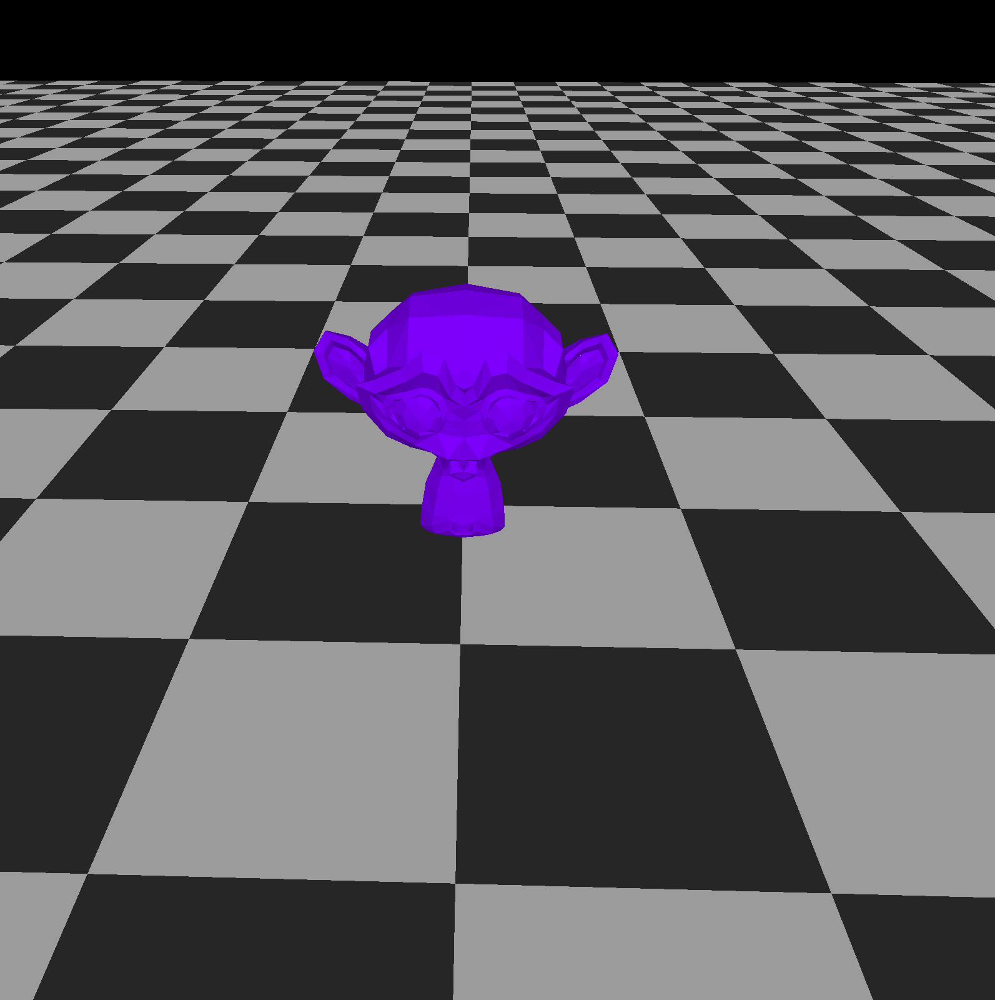

# 🖤 3d-graphis 🚀
This is a small 3D graphics engine built in **Rust**. This is a project for me to learn about 3D Graphics. Start the program up by running:

```bash
cargo run
```

---



---

## 🕹️ Controls

Here’s how you can explore the 3D world:

* **Scroll Wheel**: Zoom in and out 🔍
* **Left Click + Drag**: Move the camera 🖱️
* **Right Click + Drag**: Rotate your view 🔄


---

## 📄 License

This project is licensed under the MIT License.
